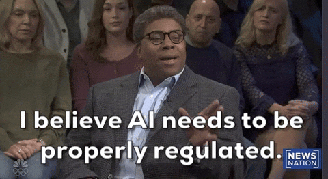

<h1 align="center">Julian Block</h1>
<h3 align="center">AI Architect · AI & Software Solutions Consultant</h3>

  

---

### 🧠 About Me

- 🏠 Based in **Las Vegas, NV** — husband, father, and lifelong learner.
- 👨‍💻 Full-stack engineer focused on **AI systems**, **frontend architecture**, and **scientific R&D**.
- 🧠 Founder of:
  - **Vivvy.ai** – AI feedback & review automation.
  - **Dreamcatcher** – AI-powered dream analysis.
  - **Project LUX∞** – Manifold-based optics simulation for infinite zoom.
- 🔬 Passionate about **optical physics**, **geometric computing**, **machine learning**, and **human-AI interaction**.
- 🚀 Currently pushing boundaries at **Silvr.ai** in fintech + ecommerce intelligence.

---

### 🌐 Connect with Me

  
  
  

---

### 🛠️ Tech Stack

 <!-- OpenAI -->  <!-- Mistral -->  <!-- Hugging Face -->  <!-- LangChain -->  <!-- FastAPI -->  <!-- Supabase -->  <!-- Pinecone -->  <!-- Weaviate -->  <!-- Ray -->  <!-- ONNX -->  <!-- Triton -->  <!-- MLflow -->  <!-- Docker (infra still matters) -->  <!-- Kubernetes -->  

---

### 🚧 Current Projects

- 🔗 **Vivvy.ai** — Conversational AI for feedback & review amplification.
- 🔭 **Project LUX∞** — Infinite zoom optics via manifold geometry & AI simulation.
- 🌙 **Dreamcatcher** — Mapping the subconscious through language and neural patterning.

---

### ⚡ Focus Areas
- AI architecture (GPT-4, RAG, LLM tuning, LangChain, HuggingFace)
- 3D simulation (Three.js, WebGL, OpenGL)
- Optical physics & manifold geometry
- Scalable cloud infra (Supabase, Docker, AWS)

---

  

---

> *Looking to collaborate?*  
> 📬 **Email:** [jblock@jblocktech.com](mailto:jblock@jblocktech.com)

